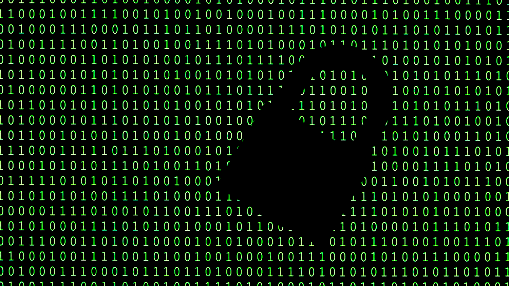

# Cryptographic Algorithms



## Overview

- Timing the execution of functions
- Visualizing data
- Number theory functions (e.g., gcd, totient, prime factors)
- Chinese Remainder Theorem and related functions
- RSA encryption, decryption, and digital signature
- Discrete Logarithm
- Elliptic Curve functions (e.g., adding points, scalar multiplication, checking if point is on curve)
- Caesar, Vigenere, Substitution and One-Time Pad ciphers
- Encoding and decoding messages
- Hashing messages

## Requirements

- Some functions  require SageMath to be installed. SageMath can be downloaded [here](https://www.sagemath.org/).

## Functions

### Basic Cryptography

- **caesar_cipher(message: str, shift_value: int):** Implements the Caesar Cipher algorithm to encode a message by shifting its characters.
- **substitution_cipher(message: str, key: str, mode: int):** Encrypts or decrypts a message using a randomized substitution cipher, based on a given key.
- **vigenere_cipher(message: str, key: str, mode: int):** Encrypts or decrypts a message using the Vigenere Cipher, based on a given key.

### RSA Cryptography

- **rsa_encrypt(plaintext: int, public_key: tuple):** Encrypts a plaintext message using RSA public key cryptography.
- **rsa_decrypt(ciphertext: int, private_key: tuple):** Decrypts an RSA ciphertext using the private key.

### Hashing and Digital Signatures

- **hash_message(message: str) -> str:** Computes the SHA-256 hash of a given message.
- **rsa_signature(hash: int, private_key: tuple) -> int:** Creates an RSA digital signature from a given hash and private key.

### Number Theory

- **gcd(x: int, y: int):** Calculates the greatest common divisor (GCD) of two numbers.
- **modinv(a: int, m: int):** Calculates the modular inverse of a number with respect to a modulus.

### Other Functions

These functions are used for various purposes, such as timing function execution, visualizing data, and more. Examples include **function_timer(func, kwargs)**, **visualize_data(x_values: list, y_values: list)**, and others.

For the utility functions, simply import the desired function and call it with the required arguments. For example, to compute the GCD of two numbers:

``` python
from crypto_algorithms import gcd

result = gcd(28, 14)
print(result)
```
